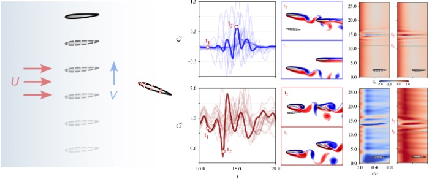

### GUST Model
we set up a graph based transformer to handle the sequence to sequence problem.


```python
#x [batch,seq_lem,sensors]--pressure sensors
#adj_matrix [batch,x,x] -- adj matrix
#condition [batch,seq_lem,1] -- aoa,depend on task
model(x,adj_matrix,condition:op)
```



### Visual .ipynbs DONE
SECTION 3_1: simulation DATA  --DONE

SECTION 3_2: EXPRIMENTAL DATA --DONE

SECTION 3_3: EXPRIMENTAL DATA inverse --DONE

SECTION 3_4: Joint applications --DONE

### For User
How to run this code？

What is the important for you to reproduce the results in the paper?

It should be have pytorch >=2.1 correspond the pyg package.

***1.Dataset folder*** 

we define the two folders within the Dataset folder (Expriments and Simulations)

Simultion dataset has one task. 
1. forward in the section 3.1 of paper


Expriments dataset has three tasks

1. forward in the section 3.2 of paper
2. inverse in the section 3.3 of paper
3. joint application in the section 3.4 of paper


***2.Bash folder*** 

we set up different command for reproduce the results of section.

For more details, plese see the comments in the bash. like: python xx/train.py --yaml "xx.yaml"


***3.Visual folder***
Visual for the plotting. We have different .ipynb files.

***4.raw cp files***
Please see in the google drive or contact author. https://drive.google.com/drive/folders/1tLQd7UaygxD8pw1dCqkD3YukA8qzo28B?usp=drive_link
benchmark paper is :On the unsteady behavior of the flow around NACA 0012 airfoil with steady external conditions at Re = 1000 

***5. Last not the least, we encourage people could use our code and fine tune in the more datasets and environment***


If you find our contributions helpful for your research, please feel free to cite our paper. 

If you have any questions regarding the use of the code, please leave a comment in the issue, and we will do our best to respond.
